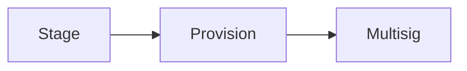
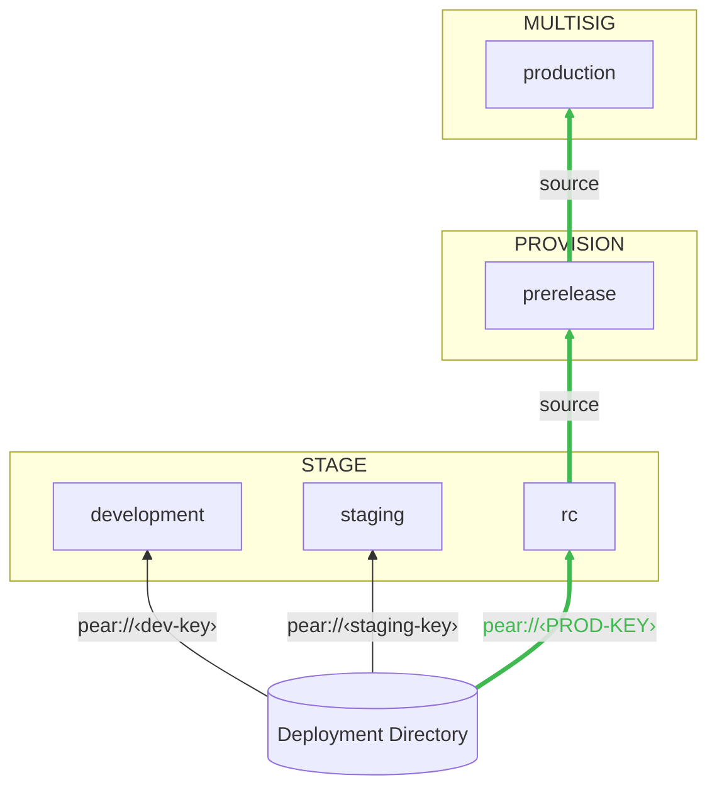
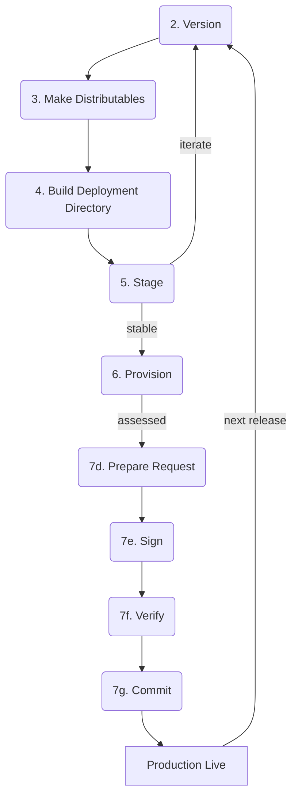
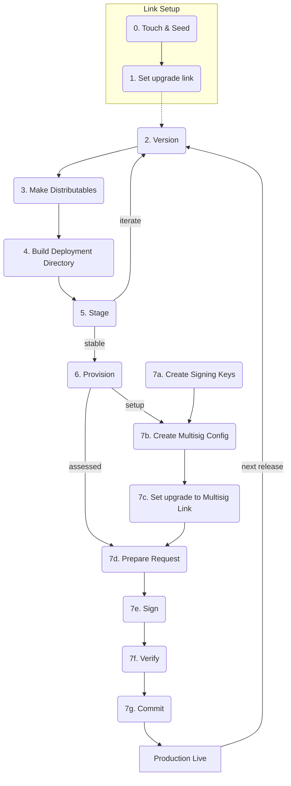
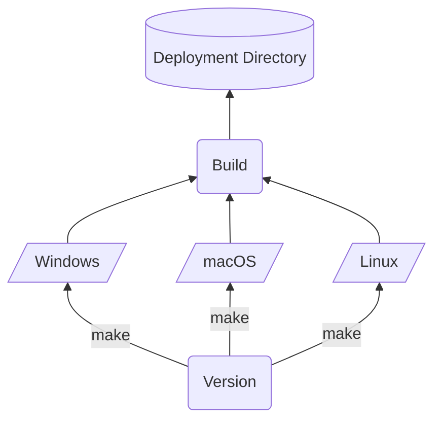
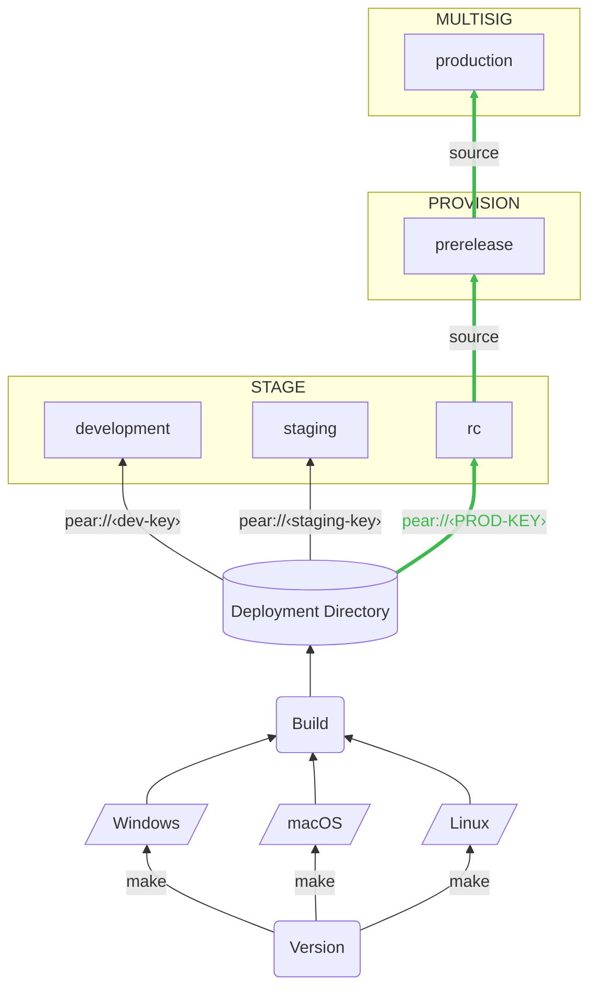
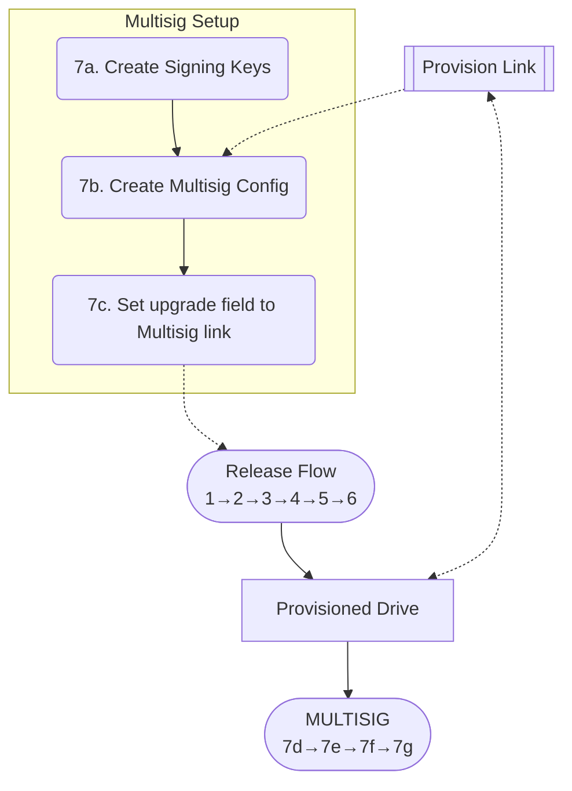
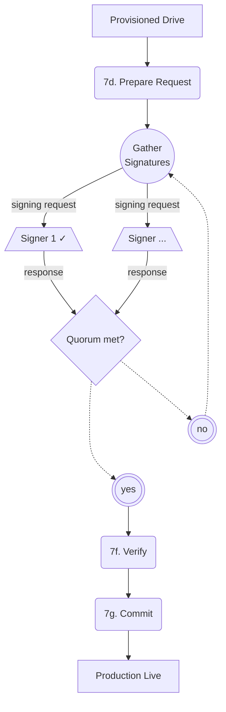
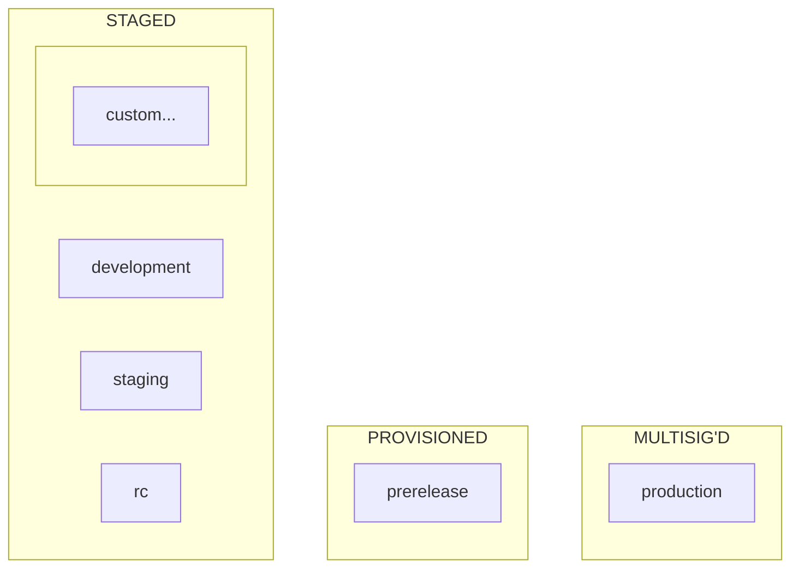

# hello-pear-electron <a name="hello-pear-electron"></a>

> Pear Hello World for Electron with `pear-runtime`

End-to-end boilerplate for embedding [pear-runtime][pear-runtime] into [Electron][electron] apps and deploying peer-to-peer application updates.

- Peer-to-Peer Over-the-Air updates with update-restart
- Embedded [bare][bare] runtime workers
- Application storage management
- Staged deployment pipeline with multisig production releases

## Table of Contents

- [OS Support](#os-support)
- [Requirements](#requirements)
- [Terminology](#terminology)
- [Development](#development)
  - [Install](#install)
  - [Start](#start)
- [Architecture](#architecture)
  - [Updates](#updates)
  - [Storage](#storage)
  - [Workers](#workers)
- [Peer-to-Peer Deployments](#deployments)
  - [Deployment Layers](#deployment-layers)
  - [Release Cycle](#release-cycle)
  - [Foundational Steps](#foundational-steps)
    - [0. Touch and Seed](#touch-and-seed)
    - [1. Set upgrade link](#set-upgrade-link)
    - [2. Version](#version)
    - [3. Make Distributables](#make-distributables)
    - [4. Build Deployment Directory](#build-deploy-directory)
    - [5. Stage](#stage)
    - [6. Provision](#provision)
    - [7. Multisig](#multisig)
  - [Practices](#practices)
    - [Release Lines](#release-lines)
    - [Release Line Builds](#release-line-builds)
    - [Custom Builds](#custom-builds)
- [CI Configuration](#ci-configuration)
- [Store Submissions](#store-submissions)
  - [Flathub](#flathub)
- [Scripts](#scripts)
- [Troubleshooting](#troubleshooting)

## OS Support <a name="os-support"></a>

- macOS
- Linux
- Windows

## Requirements <a name="requirements"></a>

- `npm` via [Node.js][nodejs]
- [`pear`][pear-docs] - `npx pear`

## Terminology <a name="terminology"></a>

- **OTA** - Over-the-Air. Data delivery without manual intervention
- **OTA Updates** - Direct software updates to running applications without manual reinstallation
- **P2P** - Peer-to-Peer. Direct point-to-point communication between machines/devices without central servers
- **application drive** - the [Hyperdrive][hyperdrive] behind a Pear application
- **deployment folder** - the build directory output by `pear build` which is then staged
- **multisig** - a co-signing protocol requiring a quorum of signers before writes can be committed. This cryptographically binds project integrity to collective sign-off
- **pear link** - a [link format][pear-link-format] for addressing peer-to-peer applications
- **quorum** - the minimum number of signers needed to commit a multisig write
- **release lines** - parallel deployment streams at different stability levels
- **seeding** - exposing a drive to peers for discovery and download
- **vendor signing** - signing distributables with OS-level certificates so they run on other machines without quarantine e.g. Apple notarization, Windows code signing
- **versioned link** - a pear link of the form `pear://<fork>.<length>.<key>` where fork, length and key correspond to [core.fork][hypercore-fork], [core.length][hypercore-length], and [core.key][hypercore-key] of the [Hypercore][hypercore] behind the [Hyperdrive][hyperdrive] behind the Pear application

## Development <a name="development"></a>

### Install <a name="install"></a>

```sh
npm install
```

### Start <a name="start"></a>

Start app in development mode:

```sh
npm start
```

When running locally, updates are turned off to avoid the built application being swapped from local development when there is an update.

To enable updates for testing update flow in local development use

```sh
npm start -- --updates
```

## Architecture

The application architecture is tightly scoped to handling P2P OTA Updates, running embedded [Bare][bare] workers and facilitating [Peer-to-Peer Deployment](#deployments) flows.

### Updates <a name="updates"></a>

An update occurs when a seeded application drive is written to.

When an update occurs, the instance will emit two events `updating` and `updated`.

```js
pear.updater.on('updating', () => {
  // update view to indicate updating in progress
})
```

```js
pear.updater.on('updated', () => {
  // update view to indicate application updated
})
```

#### Disabling Updates <a name="disabling-updates"></a>

Pass `--no-updates` flag to disable updates per application run.

To disable updates as an application default, ensure that the package.json is spread into the options (`{...pkg, ...}`) and set the `updates` field to `false`:

```json
{
  "version": "1.0.0",
  "updates": false
  ...
}
```

#### Runtime Update Flow <a name="runtime-update-flow"></a>

A running application will receive `updating` and `updated` events, which are sent to the electron renderer
process via `bridge.onPearEvent()`. After receiving the `updated` event, the `bridge.applyUpdate()` method is called. This swaps the current application path with a path to the updated application build and then removes the old application from disk. So once the application is restarted, the application path contains the new build therefore the updated application is executed on restart.

### Storage <a name="storage"></a>

A storage dir is used for persistence of peer-to-peer/local data. In development this defaults to `<tmpdir>/pear/<name>`.

In Production this is per OS:

- Mac: `~/Library/Application Support/<name>`
- Linux: `~/.config/<name>`
- Windows: `%USERPROFILE%\AppData\Local\<name>`

The `dir` option defines where peer-to-peer storage should be kept.

The `pear.storage` property holds a path to application storage, this value should be passed as to [`Corestore`][corestore] as its `storage` argument.

The `--storage` flag can be passed to use custom storage for multiple running instances. This allows for local end-to-end peer-to-peer flow.

In development custom storage can be passed as so:

```sh
npm start -- --storage /tmp/custom/storage
```

#### Setting Storage for Additional Instances <a name="additional-instances"></a>

The storage dir holds a [`Corestore`][corestore] and may hold application corestores. Running an application with a different storage location means using a separate `Corestore`, just like an app running on another machine would be using a separate `Corestore`.

An additional application instance can be run with the following (per OS).

##### macOS <a name="additional-instances-macos"></a>

```sh
open -n <name>.app --args --storage /tmp/custom/storage
```

##### Linux <a name="additional-instances-linux"></a>

```sh
./<name>.AppImage --storage /tmp/custom/storage
```

##### Windows <a name="additional-instances-windows"></a>

```sh
.\<name>.exe --storage C:\tmp\custom\storage
```

### Workers <a name="workers"></a>

The idea is to put application peer-to-peer code into a main worker that then acts as a local backend for the application view layer.

```js
const IPC = pear.run('./workers/main.js', [pear.storage])
IPC.on('data', (data) => {
  console.log('data from worker', data)
})
IPC.write('hello')
```

The `workers/main.js` would then be executed with an embedded Bare runtime.

The other side of the IPC stream can be accessed inside the worker as `Bare.IPC`.

Note how `pear.storage` is passed in as the first argument, this can be accessed via `Bare.argv[2]`.

```js
const Corestore = require('corestore')
const storage = Bare.argv[2]

Bare.IPC.on('data', (data) => console.log(data.toString()))

Bare.IPC.write('Hello from worker')

const corestore = new Corestore(storage)
//.. do more with corestore..
```

## Peer-to-Peer Deployments <a name="deployments"></a>

Use the [`pear`][pear-docs] CLI to deploy applications.

Install with:

```sh
npx pear
```

Centralized deployments tend to have at minimum a staging server for internal checks, a preview server for stakeholders and a production server for users.

Application builds are written to [pear:// links][pear-link-format] through three operations stage, provision and multisig — these are used to create successive layers of deployment with increasing trust guarantees:

- **Stage** - local checks, checks between dev peers, builds without vendor signing, feature branches, ephemeral throwaways
- **Provision** - prereleases, stakeholder preview, Quality Assurance, dogfooding
- **Multisig** - production, multisig'd by stakeholders, machine-independent, tamper-resistant

Each operation feeds into the next: a staged link is the source for a provisioned link, a provisioned link is the source for a multisig'd link.



This approach enables rapid collaborative iteration on Stage links, a stakeholder preview with Provisioned links, and cryptographically signed-off machine-independent production releases with multisig'd links.

### Deployment Layers

Release lines are deployment targets at different stability levels — from early development through to production. A single deployment folder can be staged to any of them depending on the upgrade link.

Release lines are deployment targets at different stability levels. Multiple stage links allow parallel development streams to coexist, each feeding forward through provision and multisig as confidence increases.

A deployment folder containing builds for each supported architecture is staged to a Pear link for a given release line. The upgrade link in `package.json` determines which release line a build belongs to.

For production, the rc release line must use the production (multisig) link as its upgrade link — this is the build that gets provisioned and ultimately multisig'd.



Since the rc upgrade link points to the production multisig link, rc builds do not receive OTA updates. Each rc iteration requires distributing a new build. Provision is a sync from rc, so the same applies: updates will not occur, provision builds must be distributed for checks. See [Release Lines](#release-lines) and [Release Line Builds](#release-line-builds).

### Release Cycle <a name="release-cycle"></a>

Once the [Foundational Steps](#foundational-steps) are all in place the delivery flow is always the same.



An update will not occur unless the `package.json` `version` field is updated.

Always start by updating the version:

- [2. Version](#version)

Iterate as much as needed and continually make, build and stage:

- [3. Make Distributables](#make-distributables)
- [4. Build Deployment Directory](#build-deploy-directory)
- [5. Stage](#stage)

There can be multiple stage link targets (development, staging, rc) see [Release Lines](#release-lines).

Developers can use (or make) the same [Release Line Build](#release-line-builds) pointing to the same staged link.

Once a staged application is considered stable synchronize it to a provisioned link.

Stakeholders can open a [Release Line Build](#release-line-builds) pointing to the same provisioned link.

Once a multisig link exists, the provision command is always:

```sh
pear provision <pear://<fork>.<length>.<stage-key> <pear://<provision-key> <pear://<fork>.<length>.<multisig-key>
```

- [6. Provision](#provision)

Once stakeholders, QA, dogfooder devs and any one else relevant has assessed, have a quorum of signers multisig the provision link to confirm production viability and release a production update in four steps:

- [7d. Prepare Multisig Request](#prepare-multisig-request)
- [7e. Sign](#sign)
- [7f. Verify](#verify)
- [7g. Commit](#commit)

### Foundational Steps <a name="foundational-steps"></a>

Foundational Steps bootstrap and feed into the [Release-Cycle](#release-cycle).



Establishing the entire [Release Cycle](#release-cycle) doesn't have to happen all at once. It can, but how productionized it needs to be is project-dependent. If an application is in a Proof of Concept phase, then just using a stage link will do.

If an application is intended for production release then multisig is crucial to practices, resilience and machine independence.

In order to reach a multisig deployment there are some bootstrapping steps involved. Once completed, a remaining subset of these steps is the standard [Release Cycle](#release-cycle).

Follow the foundational steps at a pace suitable to the project until the [Release Cycle](#release-cycle) is established:

- [0. Touch and Seed](#touch-and-seed)
- [1. Set upgrade link](#set-upgrade-link)
- [2. Version](#version)
- [3. Make Distributables](#make-distributables)
- [4. Build Deployment Directory](#build-deploy-directory)
- [5. Stage](#stage)
- [6. Provision](#provision)
- [7. Multisig](#multisig)
  - [7a. Create Signing Keys](#create-signing-keys)
  - [7b. Create Multisig Config](#create-multisig-config)
  - [7c. Set `upgrade` field to Multisig Link](#set-multisig-link)
  - [7d. Prepare Multisig Request](#prepare-multisig-request)
  - [7e. Sign](#sign)
  - [7f. Verify](#verify)
  - [7g. Commit](#commit)

#### 0. Touch and Seed <a name="touch-and-seed"></a>

Create a new pear link:

```sh
pear touch
```

This will output a link, for example: `pear://qxenz5wmspmryjc13m9yzsqj1conqotn8fb4ocbufwtz9mtbqq5o`.

Then seed it with `pear seed <link>`, for example:

```sh
pear seed pear://qxenz5wmspmryjc13m9yzsqj1conqotn8fb4ocbufwtz9mtbqq5o # on build machine
```

On other always-online machines reseed with:

```sh
pear seed pear://qxenz5wmspmryjc13m9yzsqj1conqotn8fb4ocbufwtz9mtbqq5o # on other machines
```

#### 1. Set upgrade link <a name="set-upgrade-link"></a>

The `package.json` `upgrade` field should be set to a `pear://` link.

Set the `package.json` `upgrade` field:

```json
{
  "version": "1.0.0",
  "upgrade": "pear://qxenz5wmspmryjc13m9yzsqj1conqotn8fb4ocbufwtz9mtbqq5o",
  ...
}
```

To set the upgrade link from the command line `npm pkg set upgrade=<link>` can be used:

```sh
npm pkg set upgrade=pear://qxenz5wmspmryjc13m9yzsqj1conqotn8fb4ocbufwtz9mtbqq5o
```

#### 2. Version <a name="version"></a>

If this is the first time leave the version at 1.0.0 and skip to Make distributables.

Use the `package.json` `version` field to set the version.

For an update to work, the version **must** be bumped.

The `npm version` command can be used to set the version.

```sh
npm version [<newversion> | major | minor | patch | premajor | preminor | prepatch | prerelease]
```

For example:

```sh
npm version patch
```

#### 3. Make Distributables <a name="make-distributables"></a>

##### Checklist <a name="make-checklist"></a>

- `package.json` `author` field populated
- `package.json` `license` field populated
- `package.json` `description` field populated
- `package.json` `name` field set per brand
- `package.json` `productName` field set per brand
- `build/icon.icns` is per brand
- `build/icon.ico` is per brand
- `build/icon.png` is per brand

##### macOS <a name="make-macos"></a>

For local development only:

```sh
npm run make
```

macOS apps that aren't signed and notarized won't run on other machines because they will be quarantined by the OS. For OTA updates to work on other machines, macOS apps must be vendor signed and notarized.

NOTE: If using pear <= v2.2.15 then `{ "pear": {"stage": {"includes": [".github"] } } }` must be added to the project `package.json`, otherwise stray `.github` folders in the dependency tree are stripped during stage and the notarized build will fail to run due to lack of signature verification caused by pear <= v2.2.15 pruning these folders during stage.

Supply signing and notarizing keys with `MAC_CODESIGN_IDENTITY`, `APPLE_TEAM_ID`, `APPLE_ID`, `APPLE_PASSWORD`

```sh
MAC_CODESIGN_IDENTITY=identity APPLE_TEAM_ID=teamid APPLE_ID=id APPLE_PASSWORD=pw npm run make
```

Instructions for obtaining credentials can be found [here][electron-forge-macos-signing]

Note `APPLE_PASSWORD` is not the sign-in password, it's an [app-specific password][apple-app-specific-password].

`build/entitlements.mac.plist` declares the permissions required by the app under macOS Hardened Runtime, which is mandatory for notarized apps. The defaults cover Bare native addon compatibility:

- `cs.allow-jit` — required for V8/Bare JIT compilation
- `cs.allow-unsigned-executable-memory` — required for the Bare runtime

Add or remove entitlements here (e.g. camera, microphone, location).

To load third-party native addons that dynamically link shared libraries built by a different developer use `cs.disable-library-validation`.

##### Windows <a name="make-windows"></a>

Requires [Windows SDK][windows-sdk] (the build auto-detects the installed version) and [PowerShell 7+][powershell-install] (`winget install Microsoft.PowerShell`).

Without signing credentials, a self-signed development certificate is automatically generated matching the `Publisher` in `AppxManifest.xml`. This certificate is cached in the local certificate store and reused across builds on the same machine, but is not portable — building on a different machine or clearing the cert store generates a new one.

```sh
npm run make
```

Edit `build/AppxManifest.xml` and ensure name, publisher, description, and executable path are correct throughout - some of these are declared in multiple locations.

Install with `Add-AppxPackage .\out\HelloPear-win32-x64\HelloPear.msix`, uninstall with `Get-AppxPackage -Name HelloPear | Remove-AppxPackage`.

Production Windows apps must be signed with a code signing certificate. The `Publisher` field in `build/AppxManifest.xml` must match the `CN` of the signing certificate. Supply a `.pfx` certificate file and password with `WINDOWS_CERTIFICATE_FILE` and `WINDOWS_CERTIFICATE_PASSWORD`:

```sh
WINDOWS_CERTIFICATE_FILE=path/to/cert.pfx WINDOWS_CERTIFICATE_PASSWORD=password npm run make
```

For OTA updates, the same certificate must be used across builds — Windows rejects updates where the `Publisher` doesn't match the installed package. Create a persistent code signing certificate following [Microsoft's MSIX signing guide][msix-signing-guide], or use a production certificate.

##### Linux <a name="make-linux"></a>

Build distributables with:

```sh
npm run make
```

#### 4. Build Deployment Directory <a name="build-deploy-directory"></a>

Each make runs on a different OS and architecture.

Use the `pear build` command to assemble all OS architecture builds into a single multi-architecture directory, referred to as the **Deployment Directory**.



Run `pear build` supplying all supported OS architectures - for example Mac x64 + arm64, Linux x64 + arm64 and Windows x64 would be:

```sh
pear build --package=package.json --darwin-arm64-app out/HelloPear-darwin-arm64/HelloPear.app --darwin-x64-app out/HelloPear-darwin-x64/HelloPear.app --linux-arm64-app out/HelloPear-linux-arm64/HelloPear.AppImage --linux-x64-app out/HelloPear-linux-x64/HelloPear.AppImage --win32-x64-app out/HelloPear-win32-x64/HelloPear.msix --target out/build
```

NOTE: Since building occurs on other machines, they need to be transferred to the build machine first, and then assembled into a Deployment Directory with pear build.

Once the `<target>/by-arch` folder is hydrated with builds for all required target architectures it's ready to move on to be staged, provisioned and multisig'd.

The resulting Deployment Directory (`./out/build`) should (and must) have the following structure at minimum:

```
/package.json
/by-arch
  /[...platform-arch]
    /app
```

Once a Deployment Directory has been assembled it can be synchronized into Pear Hyperdrives using `pear stage`, `pear provision` and `pear multisig` to create a full deployment flow.



#### 5. Stage <a name="stage"></a>

Use Pear to synchronize the Deployment Directory from disk to [hypercore][hypercore] within Pear by executing `pear stage <upgrade-link> <deploy-directory>`.

First perform a dry run:

```sh
pear stage --dry-run pear://qxenz5wmspmryjc13m9yzsqj1conqotn8fb4ocbufwtz9mtbqq5o ./out/build
```

The `pear stage` command will output file diffs showing memory sizes per file for additions, deletions and changes. Since it's a dry run no updates will have occurred. It's important to go through this output and check each file change is as expected. Once satisfied then run the operation for real:

```sh
pear stage pear://qxenz5wmspmryjc13m9yzsqj1conqotn8fb4ocbufwtz9mtbqq5o ./out/build
```

This will likewise output file diffs showing memory sizes per file for additions, deletions and changes - confirm they're the same as the dry run output to ensure nothing was accidentally altered between the dry run and the real run.

##### Confirm Stage Updates <a name="confirm-stage"></a>

Open the application on multiple different machines - the seeding process from [0. Touch and Seed](#touch-and-seed) should show peers joining as application instances are opened per machine.

Make a change, save it and repeat steps:

- [2. Version](#version) (do `npm version patch`)
- [3. Make Distributables](#make-distributables)
- [4. Build Deployment Directory](#build-deploy-directory)

As long as the `upgrade` field is pointing to the staged link, then this should trigger an update in every application on every machine it was run on, if so the steps were completed successfully. Restart the application to see the latest update.

##### Checklist <a name="stage-checklist"></a>

- Always dry run first
- Check output diffs before staging
- Checkout stage outputs against dry run output diffs

#### 6. Provision <a name="provision"></a>

With `pear stage` both additions and deletions are appended to the application drive. When productionizing an application, removing history and overhead is an important step. A provision synchronizes from another pear:// link in a way that strips additions/deletions resulting in a smaller data footprint.

Use `pear provision` to create a production-ready application drive.

The signature of `pear provision` is:

```sh
pear provision <versioned-source-link> <target-link> <versioned-production-link>
```

A versioned link takes the form `pear://<fork>.<length>.<key>`.

A provision synchronizes from the versioned production link onto the target link, and then synchronizes from the versioned source link onto the target link.

The source link would be a prior staged application, for example: `pear://0.1079.qxenz5wmspmryjc13m9yzsqj1conqotn8fb4ocbufwtz9mtbqq5o`.

The target link needs to be created and seeded, follow step:

- [0. Touch and Seed](#touch-and-seed)

Synchronize the stage key to the new provision link with the `pear provision` command.

First execute a provision dry run:

```sh
pear provision --dry-run pear://0.1079.qxenz5wmspmryjc13m9yzsqj1conqotn8fb4ocbufwtz9mtbqq5o pear://q9sopzoqgas9usoiq7uzkkwngm5pzj4zo3n4esjwwbmw6offis8o pear://0.0.q9sopzoqgas9usoiq7uzkkwngm5pzj4zo3n4esjwwbmw6offis8o
```

The `pear provision` command will output file diffs showing memory sizes per file for additions, deletions and changes. Since it's a dry run no updates will have occurred. It's important to go through this output and check each file change is as expected. Once satisfied then run the operation for real:

```sh
pear provision pear://0.1079.qxenz5wmspmryjc13m9yzsqj1conqotn8fb4ocbufwtz9mtbqq5o pear://q9sopzoqgas9usoiq7uzkkwngm5pzj4zo3n4esjwwbmw6offis8o pear://0.0.q9sopzoqgas9usoiq7uzkkwngm5pzj4zo3n4esjwwbmw6offis8o
```

> Using pear://0.0.q9sopzoqgas9usoiq7uzkkwngm5pzj4zo3n4esjwwbmw6offis8o as the third argument is only necessary while bootstrapping.

The `package.json` `upgrade` field determines where the app updates from, so to check that the provisioned link works it must be set to the provisioned link.

- [1. Set upgrade link](#set-upgrade-link)

Since this is an update, it should be versioned:

- [2. Version](#version)

The source link for the provisioned drive has to be updated with the new `package.json` `upgrade` field pointing to the provisioned link.

Make a new build that contains the new `package.json` with the new `upgrade` field, following steps:

- [3. Make Distributables](#make-distributables)
- [4. Build Deployment Directory](#build-deploy-directory)

Stage again to the stage link, following:

- [5. Stage](#stage)

Now provision again so that the `upgrade` link is set correctly on the provisioned link:

```sh
pear provision pear://0.1080.qxenz5wmspmryjc13m9yzsqj1conqotn8fb4ocbufwtz9mtbqq5o pear://q9sopzoqgas9usoiq7uzkkwngm5pzj4zo3n4esjwwbmw6offis8o pear://0.0.q9sopzoqgas9usoiq7uzkkwngm5pzj4zo3n4esjwwbmw6offis8o
```

#### Confirm Provision Updates <a name="confirm-provision"></a>

To update with provision, first update by staging, following:

- [5. Stage](#stage)

Then provision:

```sh
pear provision pear://0.1081.qxenz5wmspmryjc13m9yzsqj1conqotn8fb4ocbufwtz9mtbqq5o pear://q9sopzoqgas9usoiq7uzkkwngm5pzj4zo3n4esjwwbmw6offis8o pear://0.0.q9sopzoqgas9usoiq7uzkkwngm5pzj4zo3n4esjwwbmw6offis8o
```

As long as the `upgrade` field is pointing to the provisioned link, then this should trigger an update in every application on every machine it was run on, if so the steps were completed successfully. Restart the application to see the latest update.

##### Checklist <a name="provision-checklist"></a>

- Always dry run first
- Check dry run output diffs before provisioning

#### 7. Multisig <a name="multisig"></a>

A multisig'd application drive is recommended for serious production deployment.

A quorum is the number of signers needed to release a build.

Requiring a quorum of signers before release distributes production risk.

A malicious build cannot be published without multiple signers being compromised, enough signers to establish quorum.

An amount of signers sufficient to break quorum would have to lose their signing keys to be unable to update a production build.

A multisig'd application drive is not machine-bound. Write access is determined by signing capability.

A multisig link holds a key generated from a namespace string, a list of signing keys, and a quorum.

There are three setup steps and four common release steps.

To setup a Multisig drive follow:

- [7a. Create Signing Keys](#create-signing-keys)
- [7b. Create Multisig Config](#create-multisig-config)
- [7c. Set `upgrade` field to Multisig Link](#set-multisig-link)



Once a Multisig Drive has been setup the release flow is:

- [7d. Prepare Multisig Request](#prepare-multisig-request)
- [7e. Sign](#sign)
- [7f. Verify](#verify)
- [7g. Commit](#commit)



For a first-time release follow the full flow:

- [7a. Create Signing Keys](#create-signing-keys)
- [7b. Create Multisig Config](#create-multisig-config)
- [7c. Set `upgrade` field to Multisig Link](#set-multisig-link)
- [7d. Prepare Multisig Request](#prepare-multisig-request)
- [7e. Sign](#sign)
- [7f. Verify](#verify)
- [7g. Commit](#commit)

#### 7a. Create Signing Keys <a name="create-signing-keys"></a>

Each signer needs to generate a signing key.

The same person can use the same key to sign many different builds.

```sh
pear multisig keys get
```

Each signer should take note of the public key and provide it as their signing key.

#### 7b. Create Multisig Config <a name="create-multisig-config"></a>

Create/edit a `pear.json` file and set the `multisig` property to an object with a `namespace` string, `quorum` number and the public key strings of each signer on the `publicKeys` array property:

```json
{
  "multisig": {
    "publicKeys": ["<pubkey1>", "<pubkey2>", "<pubkey3>"],
    "namespace": "holepunchto/hello-pear-electron",
    "quorum": 2
  }
}
```

This example configuration has three signers with a quorum of two. So 2/3 signers can trigger a production release.

#### 7c. Set `upgrade` field to Multisig Link <a name="set-multisig-link"></a>

In the current working directory as `package.json` run the following to get the multisig link:

```sh
pear multisig link
```

This will output a pear link, example: `pear://69qwbihxj4c8te15wt3skj4j1g3ufmbo3mperedjqr1hb55mspoo`.

Then update the `upgrade` field of the `package.json` to the multisig link.

- [1. Set upgrade link](#set-upgrade-link)

The `upgrade` link now points to an appropriate production multisig'd application drive.

Go through the update flow steps:

- [2. Version](#version)
- [3. Make Distributables](#make-distributables)
- [4. Build Deployment Directory](#build-deploy-directory)
- [5. Stage](#stage)

When provisioning, the production link argument should be the multisig link, for example:

```sh
pear provision pear://0.1082.qxenz5wmspmryjc13m9yzsqj1conqotn8fb4ocbufwtz9mtbqq5o pear://q9sopzoqgas9usoiq7uzkkwngm5pzj4zo3n4esjwwbmw6offis8o pear://0.0.69qwbihxj4c8te15wt3skj4j1g3ufmbo3mperedjqr1hb55mspoo
```

- [6. Provision](#provision)

The `upgrade` field in the source drive (the provision drive) now points to the multisig'd application drive.

#### 7d. Prepare Multisig Request <a name="prepare-multisig-request"></a>

```sh
pear multisig request <versioned link>
```

Where `<versioned link>` is a seeded provision link, described per `pear://<fork>.<length>.<key>`. For example:

```sh
pear multisig request pear://0.856.q9sopzoqgas9usoiq7uzkkwngm5pzj4zo3n4esjwwbmw6offis8o
```

This will return a signing request.

Note: `pear multisig request` performs several checks before requesting and committing multisig requests, to protect against accidentally corrupting the production build.

One of the checks ensures the source drive is healthily seeded. If this is not the case, `pear multisig request` refuses to make the signing request. Solve it by reseeding the provision link on other peers.

#### 7e. Sign <a name="sign"></a>

`pear multisig` offers protection from formal mistakes that corrupt the production build, but it is up to the signers to verify that they are signing the correct build.

To sign a request, run

```sh
pear multisig sign <signing request>
```

Then share the response. Once a quorum of signers (2 in the example) share their response, the build is ready to go out.

#### 7f. Verify <a name="verify"></a>

To check for formal mistakes before signing be sure to verify. Do not sign a build if verification fails.

```sh
pear multisig verify <source-link> <signing request> [...responses]
```

For multisigging a production release the `<source-link>` should be a provisioned link, but a staged link will also work.

Run the command without responses to verify the request, then once reponses are provided run the command again passing responses in as additional parameters after the `<signing request>`.

#### 7g. Commit <a name="commit"></a>

It does not matter on which machine the commit is run.

Only commit after verifying the request and all responses.

```sh
pear multisig commit <source-link> <signing request>
```

For multisigging a production release the `<source-link>` should be a provisioned link, but a staged link will also work.

The commit is not safely finished until that drive's key is seeded by peers.

Make sure it's seeding with `pear seed <multisig-link>`, the output will show the same.

Once the program detects at least 2 seeders have fully downloaded the multisig drive, it is safe to shut it down (ctrl-c).

Never abort a commit while it is running. If a commit does get aborted while running, run the commit again as soon as possible, since the production build is then stuck in an intermediate state.

It need not be a signer who commits as the request and the responses suffice to generate the build. This is the reason why `pear multisig` verifies that the source drive is well seeded.

Any multisig'd link can be queried for public signing keys and quorum with:

```sh
pear info --multisig <link>
```

### Practices <a name="practices"></a>

#### Release Lines <a name="release-lines"></a>

A reasonable target deployment is three stage drives, one provision drive and one multisig drive.

- **development** - staged for developer team experimentation
- **staging** - staged for wider developer and technical stakeholders, more stable than development
- **rc** - staged release candidate, ultra stable
- **prerelease** - provisioned from rc source
- **production** - multisig'd from prerelease source

Besides these ephemeral release lines, additional internal lines can be staged and seeded at-will for experiments, hotfixes, feature spikes, forks and instrumented builds for shared debugging. Whether ephemeral or long-lived these can all be categorized as custom lines.



For each of these lines:

- [0. Touch and Seed](#touch-and-seed)
- [1. Set upgrade link](#set-upgrade-link)
- [3. Make Distributables](#make-distributables)

Note: No need to version since this creates an initial application build for a release line.

For small teams/lean projects just rc, prerelease and production lines can work, but a staging key is good for checking update flow first.

#### Release Line Builds <a name="release-line-builds"></a>

Create a build that points to each link for each release line.

- [1. Set upgrade link](#set-upgrade-link)
- [3. Make Distributables](#make-distributables)
- [4. Build Deployment Directory](#build-deploy-directory)

Share the stage build with developer collaborators.

Share the provision build with stakeholders, especially signers.

Any updates to the stage or provision links will then update in the dedicated application builds.

#### Custom Builds <a name="custom-builds"></a>

The `upgrade` field can be set to one link only. Share alternative builds internally peer-to-peer by forking, creating a custom stage link, seeding, building and sharing custom staged builds with developer collaborators.

- [0. Touch and Seed](#touch-and-seed)
- [1. Set upgrade link](#set-upgrade-link)
- [2. Version](#version)
- [3. Make Distributables](#make-distributables)
- [4. Build Deployment Directory](#build-deploy-directory)
- [5. Stage](#stage)

## CI Configuration <a name="ci-configuration"></a>

Create a GitHub environment (Settings -> Environments) named `release`. Run the `Build Release` workflow to build in CI. This workflow requires these secrets for signed builds:

| Secret                    | Platform | Notes                                                       |
| ------------------------- | -------- | ----------------------------------------------------------- |
| `CERTIFICATE_P12`         | `darwin` | Base64 export of Developer ID Application `.p12`            |
| `CERTIFICATE_PASSWORD`    | `darwin` | Password used to export the `.p12`                          |
| `MAC_CODESIGN_IDENTITY`   | `darwin` | e.g. `Developer ID Application: Name (TEAMID)`              |
| `APPLE_ID`                | `darwin` | Apple Developer account email                               |
| `APPLE_PASSWORD`          | `darwin` | App-specific password (not the account password)            |
| `APPLE_TEAM_ID`           | `darwin` | Membership details at <https://developer.apple.com/account> |
| `WINDOWS_CERT_PFX_BASE64` | `win32`  | Base64 export of Windows `.pfx`                             |
| `WINDOWS_CERT_PASSWORD`   | `win32`  | Password for the Windows `.pfx`                             |

- macOS signing requires an [Apple Developer Program](https://developer.apple.com) membership.
- Windows certificate 'subject' must match the `Publisher` in [AppxManifest.xml](build/AppxManifest.xml).
- Linux builds are not signed, no configuration needed.

## Store Submissions <a name="store-submissions"></a>

Applications built from this template can also be distributed through platform-specific application stores.

### Flathub <a name="flathub"></a>

Flathub packages applications as Flatpaks. This section covers preparing a Flatpak manifest and submitting releases for review.

Fork the [flathub repository](https://github.com/flathub/flathub) in your GitHub organization, clone it and create a branch targeting the `new-pr` branch of the repository:

```sh
$ git clone git@github.com:<org>/flathub.git
$ cd flathub
$ git checkout -b my-app-submission -t new-pr
```

Create these files in the flathub directory:

- metainfo file using the [appstream web form](https://www.freedesktop.org/software/appstream/metainfocreator/#/), like [`com.pears.HelloPear.metainfo.xml`](./flatpak/com.pears.HelloPear.metainfo.xml)
- Flatpak YAML file, like [`com.pears.HelloPear.yml`](flatpak/com.pears.HelloPear.yml)

#### Testing

Install the Flatpak tools:

```sh
$ sudo apt install flatpak
$ flatpak remote-add --if-not-exists --user flathub https://dl.flathub.org/repo/flathub.flatpakrepo
$ flatpak install flathub org.flatpak.Builder
```

In the project directory, [build](#make-linux) the app and serve the generated Flatpak artifacts over HTTP:

```sh
$ python3 -m http.server --directory out/make/
```

In the `flatpak` directory, build and install the Flatpak:

```sh
$ flatpak run --command=flathub-build org.flatpak.Builder --disable-rofiles-fuse com.pears.HelloPear.yml
$ flatpak install --user ./repo com.pears.HelloPear
```

Repeat the build command after making any changes to the manifest.

Launch the application from your desktop environment or run it from the CLI:

```sh
$ flatpak run com.pears.HelloPear
```

Uninstall using:

```sh
$ flatpak uninstall com.pears.HelloPear
$ rm -rf ~/.var/app/com.pears.HelloPear
```

If the builds take up too much memory, clear these build files from the `flatpak` directory:

```sh
$ rm -rf builddir repo .flatpak-builder
```

After confirming that the Flatpak works:

- Upload the Flatpak artifacts to a publicly accessible location with versioned URLs like [this site](https://static.keet.io/downloads/) and update the artifact links in the Flatpak YAML.
- For verification, upload an empty file to your app website `https://<app-website>/.well-known/org.flathub.VerifiedApps.txt`.
- Open a PR on the [flathub repository](https://github.com/flathub/flathub) from your branch for submission, like [this PR](https://github.com/flathub/flathub/pull/8716).
- Address all the review comments.
- Comment `bot, build` to test building the Flatpak on the Flathub CI.
- Once the submission is accepted, the Flathub maintainers create a repository in the flathub organization with the changes from the submission branch, like [this repository](https://github.com/flathub/io.keet.Keet).
- Log in to the [Flathub Developer Portal](https://flathub.org/en/developer-portal) to manage the app and complete the verification by copying the token from this page to the app website `https://<app-website>/.well-known/org.flathub.VerifiedApps.txt`.
- In a few hours, the app should be available on Flathub, like [this app](https://flathub.org/en/apps/io.keet.Keet).

If the app doesn't show up on Flathub:

- If the Flathub bot opens an issue on the repository containing build errors, address it.
- If it's unrelated, comment `bot, retry` or open an issue in [Flathub](https://github.com/flathub/flathub/issues) for assistance from the maintainers.
- Follow the build status at <https://builds.flathub.org>. App-specific build status is available at `https://builds.flathub.org/status/<app-id>`.

To automate the Flathub bot to open PRs when new versions of the app are available on the website, follow [this guide](https://github.com/flathub-infra/flatpak-external-data-checker/#changes-to-flatpak-manifests) and set up the external data checker on the `type: archive` source like this depending on the format of the app site contents:

```yml
x-checker-data:
  type: html
  url: https://static.keet.io/downloads/
  version-pattern: href="((?:\d+\.)+\d+)/"
  url-template: https://static.keet.io/downloads/$version/Keet-arm64-flatpak.tar.gz
```

## Scripts <a name="scripts"></a>

### `npm start` <a name="script-start"></a>

Start app in development mode.

```sh
npm start
```

Uses: `electron-forge start -- --no-updates`

---

### `npm run lint` <a name="script-lint"></a>

Check formatting and linting.

```sh
npm run lint
```

Runs:

- `prettier --check .`
- `lunte`

---

### `npm run format` <a name="script-format"></a>

Auto-format and fix lint issues.

```sh
npm run format
```

Runs:

- `prettier --write .`
- `lunte --fix`

---

### `npm run package` <a name="script-package"></a>

Package app without creating distributables.

```sh
npm run package
```

Runs: `electron-forge package`

---

### `npm run make` <a name="script-make-linux"></a>

Create distributables.

```sh
npm run make
```

Runs: `electron-forge make`

---

## Troubleshooting <a name="troubleshooting"></a>

### App did not update <a name="app-did-not-update"></a>

#### Was the version updated? <a name="check-version-updated"></a>

See [2. Version](#version)

#### Is the upgrade link correct? <a name="check-upgrade-link"></a>

[1. Set upgrade link](#set-upgrade-link)

#### Is the app seeded? <a name="check-app-seeded"></a>

The upgrade link must be seeded:

```sh
pear seed <link>
```

#### Was the app seeded after opening the app? <a name="check-seeded-after-open"></a>

Just wait about 15 minutes if there is no rush.

Also add the key to a few always-on seeders. Then there is less dependence on subtleties and this issue won't occur.

Explanation (advanced):

- The client looks for peers who have the key when starting up, and will do another lookup roughly every 15 minutes
- The server announces the key, so clients who look up the key will connect to the server

With the following order of events, the client will not connect to the seeder until its second lookup

- Seeder is offline, and nobody else is seeding
- Client comes online, looks up the key and finds nobody
- Seeder comes online and announces the key
- After about 15 minutes, the client does another lookup, and now connects to the seeder

#### Is the seeder unreachable? <a name="check-seeder-unreachable"></a>

Add the key to a few always-on seeders. Then there is less dependence on the seeder being reachable.

### Recovering from lost write-access <a name="lost-write-access"></a>

Staged and provisioned drives are machine-bound. If data is lost, write access to those keys is lost.

Multisig drives are not machine-bound.

If a stage link is lost, just create a new link and stage to it - update the stage builds.

If a provision key is lost, make a new one using production as the source:

```sh
pear provision <versioned-production-key> <target-key> <versioned-production-key>
```

Then provision to the new prerelease key with stage key as source.

```sh
pear provision <versioned-stage-key> <target-key> <versioned-production-key>
```

Then pass this new provision link to `pear multisig verify` and `pear multisig commit` commands.

### `pear stage` is showing unexpected size increases <a name="stage-size-increases"></a>

#### Is the `pear build` deployment folder inside the app folder? <a name="check-deployment-folder-inside-app"></a>

If the deployment folder ends up in the build and then that ends up in the deployment folder the build inflates each time. When it comes to running `pear stage` it will show file sizes that are unexpectedly large.

Avoid this by never putting the deployment folder into the application folder.

The deployment folder output by `pear build` can be considered as a sort of multi-architecture container.
Think about it as above, external to the project as a deployment artifact instead of inside the project.

Never make deployment folders inside applications:

```sh
pear build ... --package ./my-app/package.json --target ./my-app/my-build # <-- DON'T DO THIS

cd my-app && pear build ... --package ./package.json --target ./my-build # <-- DON'T DO THIS
```

Always make the deployment folder outside of the app-dir:

```sh
pear build ... --package ./my-app/package.json --target ./my-build # <-- do this
```

Or don't use target at all and always run pear build outside of the app folder:

```sh
pear build ... --package ./my-app/package.json # <-- do this
```

That will output a build folder per version e.g. `hello-pear-electron-v1.2.3` creating a deploy folder per deploy. This can be very useful for reviewing any deployment issues and for quickly rolling back to a prior version (i.e. stage -> provision -> multisig from an older build folder).

### `pear multisig commit` errors with `INCOMPATIBLE_SOURCE_AND_TARGET` error

Starting from the second commit, it is technically possible to corrupt the production build e.g. due to accidental interuption. So if a command ever errors with an `INCOMPATIBLE_SOURCE_AND_TARGET` error, never try to work around it. The only safe way to proceed is by creating a new source link using `pear provision`.

```sh
pear touch
```

```sh
pear provision <source-verlink> <touched-link> <production-multisig-link>
```

Where source-verlink is the link used as the source of the original provisioned drive.

Then commit with

```sh
pear multisig commit <touched-link> <request> ...responses
```

<!-- Reference Links -->

[pear-runtime]: https://github.com/holepunchto/pear-runtime
[electron]: https://www.electronjs.org/
[bare]: https://github.com/holepunchto/bare
[nodejs]: https://nodejs.org
[pear-docs]: https://docs.pears.com
[hyperdrive]: https://github.com/holepunchto/hyperdrive
[hypercore]: https://github.com/holepunchto/hypercore
[hypercore-fork]: https://github.com/holepunchto/hypercore#corefork
[hypercore-length]: https://github.com/holepunchto/hypercore#corelength
[hypercore-key]: https://github.com/holepunchto/hypercore?tab=readme-ov-file#corekey
[pear-link-format]: https://github.com/holepunchto/pear-link?tab=readme-ov-file#pear-link-format
[corestore]: https://github.com/holepunchto/corestore
[electron-forge-macos-signing]: https://www.electronforge.io/guides/code-signing/code-signing-macos#option-1-using-an-app-specific-password
[apple-app-specific-password]: https://support.apple.com/en-us/102654
[windows-sdk]: https://developer.microsoft.com/en-us/windows/downloads/windows-sdk/
[powershell-install]: https://learn.microsoft.com/en-us/powershell/scripting/install/installing-powershell-on-windows
[msix-signing-guide]: https://learn.microsoft.com/en-us/windows/msix/package/create-certificate-package-signing
